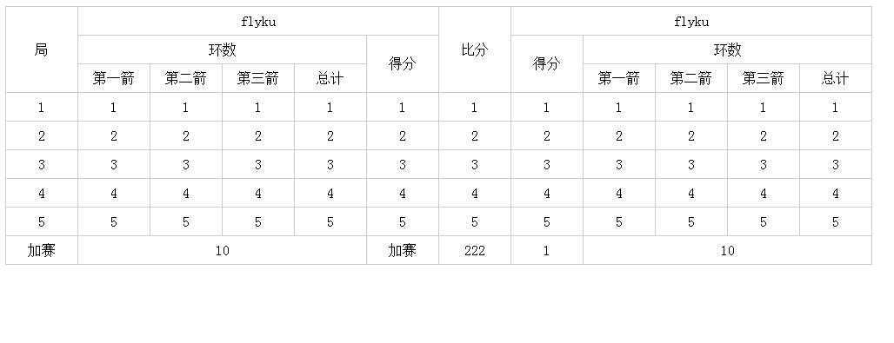

#README.md
###使用方法
#引入js
```
<script type="text/javascript" charset="utf-8" src="table.js"></script>
###或者amd cmd commonjs规范引入
```
###根据二维数组生成对应表格
```可以设置colspan rowspan```
```使用方法```

###配置二维数组
```ini
var cellLists = [
        cell(["1", "2", "3", "4", "5"].concat([{
            html: "加赛"
        }]), [{
            html: '局',
            rowSpan: 3
        }]),
        cell([1, 2, 3, 4, 5].concat([{
            html: 10,
            colSpan: 4
        }]), [{
            html: "flyku",
            colSpan: 5
        }].concat([{
            html: "环数",
            colSpan: 4
        }]).concat([{
            html: "第一箭"
        }])),

        cell([1, 2, 3, 4, 5], [{
            html: '第二箭'
        }]),
        cell([1, 2, 3, 4, 5], [{
            html: '第三箭'
        }]),
        cell([1, 2, 3, 4, 5], [{
            html: '总计'
        }]),
        cell([1, 2, 3, 4, 5].concat([{
            html: "加赛"
        }]), [{
            html: '得分',
            rowSpan: 2
        }]),

        cell([1, 2, 3, 4, 5].concat([{
            html: 222
        }]), [{
            html: '比分',
            rowSpan: 3
        }]),

        cell([1, 2, 3, 4, 5].concat([{
            html: 1
        }]), [{
            html: "flyku",
            colSpan: 5
        }].concat([{
            html: "得分",
            rowSpan: 2
        }])),
        cell([1, 2, 3, 4, 5].concat([{
            html: 10,
            colSpan: 4
        }]), [{
            html: '环数',
            colSpan: 4
        }].concat([{
            html: "第一箭"
        }])),
        cell([1, 2, 3, 4, 5], [{
            html: '第二箭'
        }]),
        cell([1, 2, 3, 4, 5], [{
            html: '第三箭'
        }]),
        cell([1, 2, 3, 4, 5], [{
            html: '总计'
        }])
    ];
```
###生成table
```ini
var data = table(cellLists);
```
###插入html（使用模板插入，underscore模板等等！）
```ini
var str = '<table padding="0" cellspacing="0" border="0">
    <thead></thead>
    <tbody>
        <% for(var i=0;i<data.rows.length;i++){%>
            <tr>
                <% for(var j=0;j<data.rows[i].length;j++){%>
                    <td rowspan="<%= data.rows[i][j].rowSpan || 1 %>" colspan="<%= data.rows[i][j].colSpan || 1 %>" data-id="<%= data.rows[i][j].uniqId %>">
                        <%= data.rows[i][j].html %>
                    </td>
                <% }; %>
            </tr>
        <% }; %>
    </tbody>
</table>';
    var template = _.template(str);
    document.getElementById("table").innerHTML = template(data);
```

###效果预览
```效果展示

```